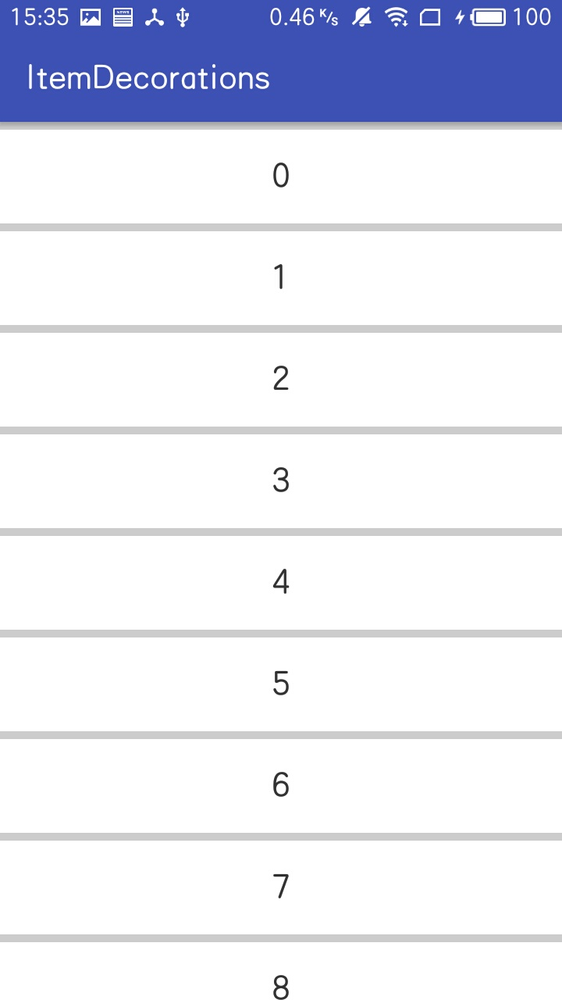
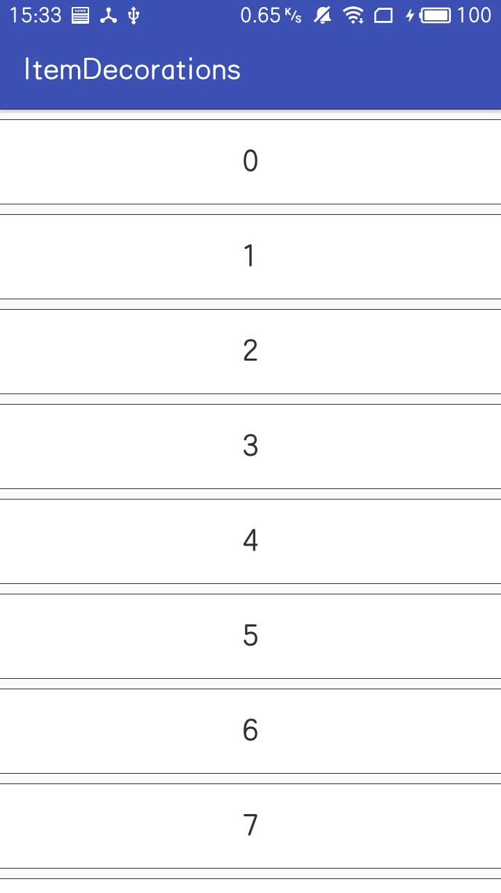
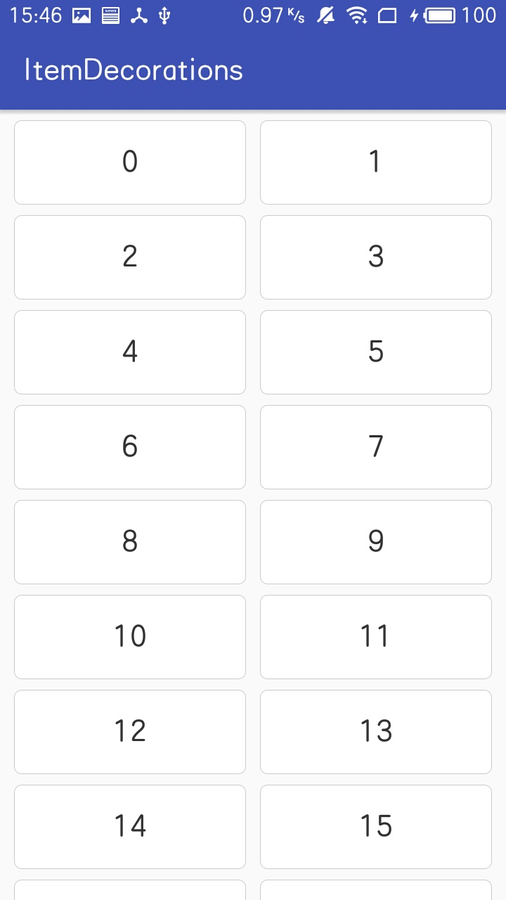

# ItemDecoration for RecyclerView
能够帮助实现RecyclerView分割线效果的ItemDecoration<br>
支持RecyclerView线性，网格，瀑布流布局

ItemDecorations allows you to draw divider between items in recyclerview

## Support
- LinearLayoutManager
  - Vertical
  - Horizontal
- GridLayoutManager
  - Vertical
  - Horizontal
- StaggeredGridLayoutManager

## Image
<div>
  
  
  
</div>

## Gradle
Add the dependency
```
dependencies {
        compile 'com.aches.plugin:itemdecorations:1.0.1'

        // 3.0
        // implementation 'com.aches.plugin:itemdecorations:1.0.1'
}
```

## How To Use
分割线支持设置颜色以及Drawable, 如果有其它方式, 也可通过继承[BaseProvider](https://github.com/AchesKkk/ItemDecorations/blob/master/lib-itemdecorations/src/main/java/com/sheldonchen/itemdecorations/provider/base/BaseProvider.java)进行自定义.
```
  Drawable dividerDrawable = getResources().getDrawable(R.drawable.shape_divider_vertical);
  int dividerColor = getResources().getColor(R.color.divider);
  
  LinearLayoutDivider divider = new LinearLayoutDivider.Builder()
          .setOrientation(LinearLayoutManager.VERTICAL)
          .drawFirstDivider(true)
          .drawLastDivider(true)
          .setStartPadding(0)
          .setEndPadding(0)
          .setDividerColor(dividerColor)
//          .setDividerDrawable(dividerDrawable)
//          .setProvider(new DrawableProvider(dividerDrawable))
//          .setProvider(new ColorIntProvider(dividerColor))
          .setDividerThickness(10)// 设置分割线的厚度.
          .build();
  recyclerview.addItemDecoration(divider);
```
```
  Drawable dividerDrawable = getResources().getDrawable(R.drawable.shape_divider);
  int dividerColor = getResources().getColor(R.color.divider);

  GridLayoutDivider divider = new GridLayoutDivider.Builder()
          .setOrientation(LinearLayoutManager.VERTICAL)
          .drawTopSideDivider(true)
          .drawBottomSideDivider(true)
          .drawTwoSidesDivider(true)
          .setDividerColor(dividerColor)
          .setSideDividerColor(dividerColor)
//          .setDividerDrawable(dividerDrawable, dividerDrawable)
//          .setProvider(new ColorIntProvider(dividerColor), new ColorIntProvider(dividerColor))
//          .setProvider(new DrawableProvider(dividerDrawable), new DrawableProvider(dividerDrawable))
          .setDividerThickness(15)
          .setSideDividerThickness(20)
          .build();
  recyclerview.addItemDecoration(divider);
```


# License
```
Copyright (C) 2018 AchesKkk

Licensed under the Apache License, Version 2.0 (the "License");
you may not use this file except in compliance with the License.
You may obtain a copy of the License at

http://www.apache.org/licenses/LICENSE-2.0

Unless required by applicable law or agreed to in writing, software
distributed under the License is distributed on an "AS IS" BASIS,
WITHOUT WARRANTIES OR CONDITIONS OF ANY KIND, either express or implied.
See the License for the specific language governing permissions and
limitations under the License.
```
